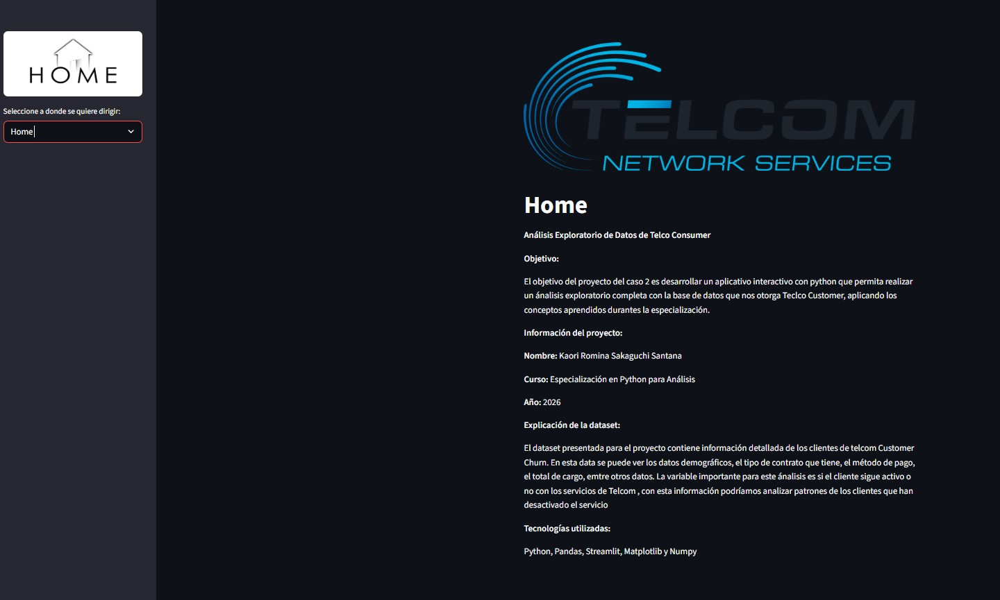
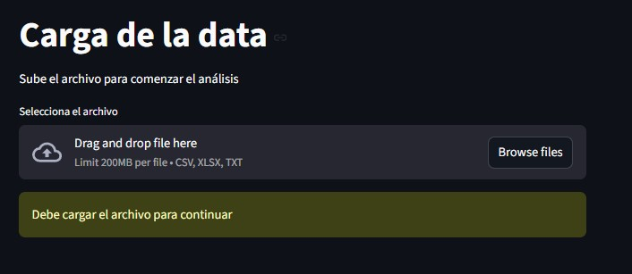
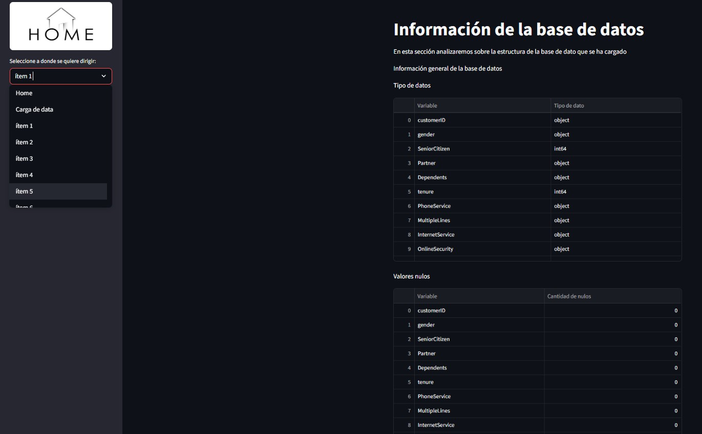
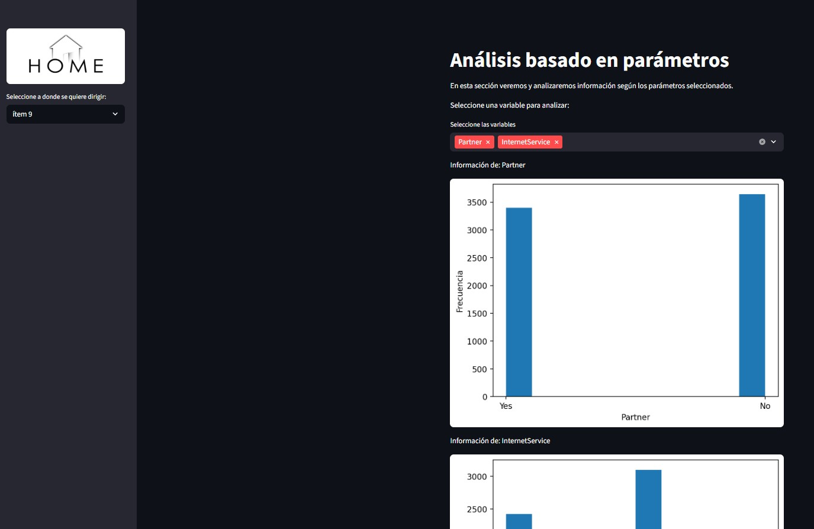

# TRABAJO-FINAL-PYTHON

Analisis exploratorio: Telcom Constomer

**Descripción del proyecto**
En este trabajo final consiste en el desarrollo de una aplicación interactiva, realizada en python y visualizada en streamlit para realizar un anaalisis exploratorio de datos (EDA) sobre la base de datos de la empresa telcom.

**Objetivo del proyecto**
El objetivo principal de este proyecto es determinar patrones que nos ayuden a identificar porque los clientes cancelan o abandonan los servicios de telcom
Los otros objetivos son:
  1. Analizar la estructura de la base de datos
  2. Identificar cada tipo de variables, y cuantificarlas
  3. Evaluar relaciones entre los diferentes tipos de variables
  4. Detectar y llegar a obtener insights
  5. Detectar porque los clientes abandonan los servicios de telcom

**Base de datos**
Esta base de datos pertenece a la empresa telcom comunicaciones, una empresa de telecomunicaciones, incluyendo:
 1. Datos demográficos
 2. Datos de pagos
 3. Metodos de pago
 4. Tipos de contratos
 5. Estado del servicio

**Capturas de la aplicación**

*Página principal*

*Carga de datos*
.

*Menú e ítems*
.

*Ejemplo de item*
.

**Link importante**
*Aplicación Streamlit*

https://trabajo-final-python-2026-y9arvwtn4ohnu2acdxathv.streamlit.app/

*

